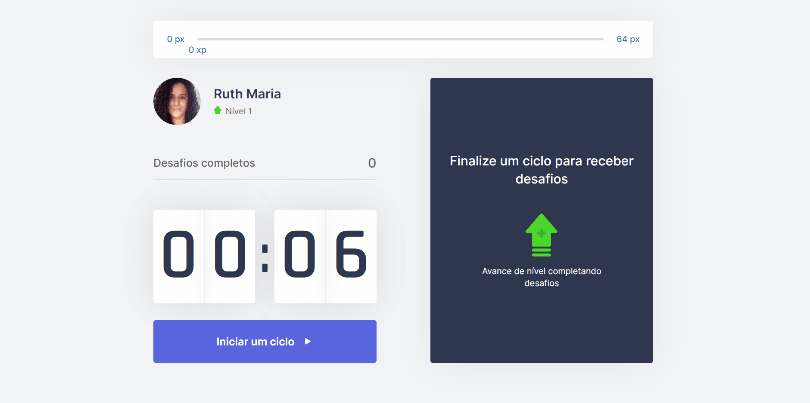

<h1 align="center">
  <a href="https://github.com/csorlandi/nodejs-concepts">
    
  </a>
</h1>

<p align="center">
  <a href="#execution">Preview</a>&nbsp;&nbsp;&nbsp;|&nbsp;&nbsp;&nbsp;
  <a href="#technologies">Technologies Used</a>&nbsp;&nbsp;&nbsp;|&nbsp;&nbsp;&nbsp;
  <a href="#run">How to run the project</a>&nbsp;&nbsp;&nbsp;|&nbsp;&nbsp;&nbsp;
  <a href="#contribute">How to contribute</a>&nbsp;&nbsp;&nbsp;|&nbsp;&nbsp;&nbsp;
  <a href="#license">License</a>
</p>


<p align="center">
 

  

  
</p>

<br>

## :books: About


Time management application like the pomodoro - the technique consists of using a stopwatch to divide the work into periods of 25 minutes, separated by brief intervals. For each 25 minutes completed cycle, the user will receive a challenge, which consists of performing a physical exercise to exercise, and if completed, will level up.

<a id="execution"></a><br>

 ## :tv: Preview



<br>

<a id="technologies"></a><br>

## ⚒️ Technologies Used
  * React.js
  * TypeScript
  * Next
  * CSS module
  * Content API
  * Cookie


<a id="run"></a><br>

## 🚀 How to run the project


<br>

- Clone this repository

```
git clone https://github.com/RuthMaria/moveit.git
```
- Install dependencies

```
yarn
```

- Run the project

```
yarn dev
```

<br>

## 🎯 How to contribute

- Fork this repository,
- Create a branch with your feature: `git checkout -b my-feature`
- Commit your changes: `git commit -m 'feat: My new feature'`
- Push your branch: `git push origin my-feature`

<a id="license"></a><br>

## :memo: License

This project is under the MIT license. See the  file [LICENSE](LICENSE) for more details.

---

<h4 align="center">
    Developed with ❤️ by <a href="https://www.linkedin.com/in/ruth-maria-9b256071/" target="_blank">Ruth Maria</a>
</h4>
